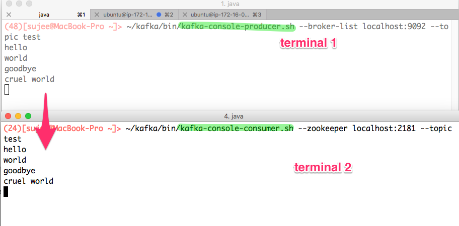

<link rel='stylesheet' href='../assets/css/main.css'/>

[<< back to main index](../README.md)

# Lab 2.1 : Kafka Command Line Utilities
---

### Change Log

Updated 2023-10-28

Rod Davison

---
## Overview

Use Kafka Command line utils

## Depends On

None

## Run time

10 Minutes


## Quick Note: 

`--bootstrap-server`  or `--zookeeper`

The older version of Kafka commands used `-zookeeper` flag.

For example:

```bash
  ~/apps/kafka/bin/kafka-topics.sh  --zookeeper localhost:2181 --list
```

In newer clients, and specifically the one you are using for the labs, `--zookeeper` flag is being replaced by `--bootstrap-server` option.


```bash
~/apps/kafka/bin/kafka-topics.sh --bootstrap-server localhost:9092 --list
```
If you use the `--zookeeper` flag in a command, you will probably get a warning that its use is deprecated and the Kafka command will not run.

## Step 1 : Open two terminals to your Kafka node


# Step 2 : Create Topics

Inspect current topics. There should be no output yet since you have not created any topics.

If you do see topics listed and want to start with a clean Kafka broker, follow the instructions in lab 01 for resetting your servers.

```bash
 ~/apps/kafka/bin/kafka-topics.sh --bootstrap-server localhost:9092 --list
```

create a `test` topic with one replica per partition (the default) and two partitions.

```bash
~/apps/kafka/bin/kafka-topics.sh  --bootstrap-server localhost:9092 --create --topic test --replication-factor 1  --partitions 2
```

Verify that the topic has been created.

```bash
~/apps/kafka/bin/kafka-topics.sh  --bootstrap-server localhost:9092  --list
```

Use the `--describe` command to get information about the topic. 

```bash
 ~/apps/kafka/bin/kafka-topics.sh --bootstrap-server localhost:9092 --describe --topic test
```
You should see something like this:

```console

Topic: test	TopicId: 5Z5kwHaySUuZHorA_S3RaQ	PartitionCount: 2	ReplicationFactor: 1	Configs: 
	Topic: test	Partition: 0	Leader: 0	Replicas: 0	Isr: 0
	Topic: test	Partition: 1	Leader: 0	Replicas: 0	Isr: 0
```
Note that the `Leader` value is the id number of the replicas for the partition that is the main or write replica. The `Replicas` field provides a list of replica numbers, but we only have one replica which has the id=0. 

# Step 3 : Sending some messages

In terminal-1, start a Kafka command line producer. You should see the input prompt `>`

```bash
~/apps/kafka/bin/kafka-console-producer.sh --bootstrap-server localhost:9092 --topic test
```

In terminal-2, start a Kafka command line consumer. There will be no initial output.

```bash
~/apps/kafka/bin/kafka-console-consumer.sh --bootstrap-server localhost:9092 --topic test
```

In the producer terminal type some data. Watch the output in the consumer terminal.

Click on the image to see larger version.
<a href="../assets/images/2c.png"></a>

## Step 4 : Reading from the beginning

Stop the consumer using `Ctrl+c`

Restart the command line consumer with the  `--from-beginning` flag

```bash
~/apps/kafka/bin/kafka-console-consumer.sh --bootstrap-server localhost:9092 --topic test --from-beginning
```
Is the consumer reading the data in the same order as you typed it in at the producer terminal?  Why or why not?

## Step 5: Read From a Specific Partition

Use `ctl-C` to shut down the consumer and restart it so that it only reads from partition 1 but use the `--from-beginning` option

```bash
~/apps/kafka/bin/kafka-console-consumer.sh --bootstrap-server localhost:9092 --topic test --partition 1  --from-beginning
```
In a new third terminal, start another console consumer that reads from partition 0

```bash
~/apps/kafka/bin/kafka-console-consumer.sh --bootstrap-server localhost:9092 --topic test --partition 0  --from-beginning
```
 Depending on the number of messages you sent, you may see all the messages in partition 0. In the absence of a key or specific directive from the producer to write to a specific partition, Kafka will write batches of messages to the partitions in a round-robin manner

## Step 6: Read From a Specific Offset

Use `ctl-C` to shut down the consumer and restart it so that it only reads from partition 1 but use the `--offset` option. Because each partition has its own offset, the partition must also be specified.  Use the partition where you know the data has been written.

```bash
~/apps/kafka/bin/kafka-console-consumer.sh --bootstrap-server localhost:9092 --topic test --partition 0 --offset 2 
```
## Step 6: Clean Up
 Shut down the consumers and producers

---

## End Lab

