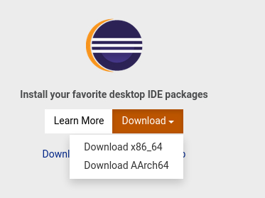
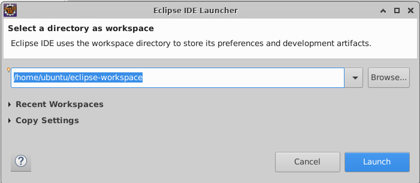
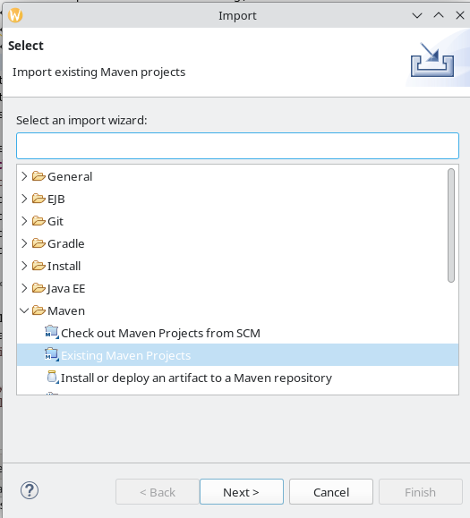
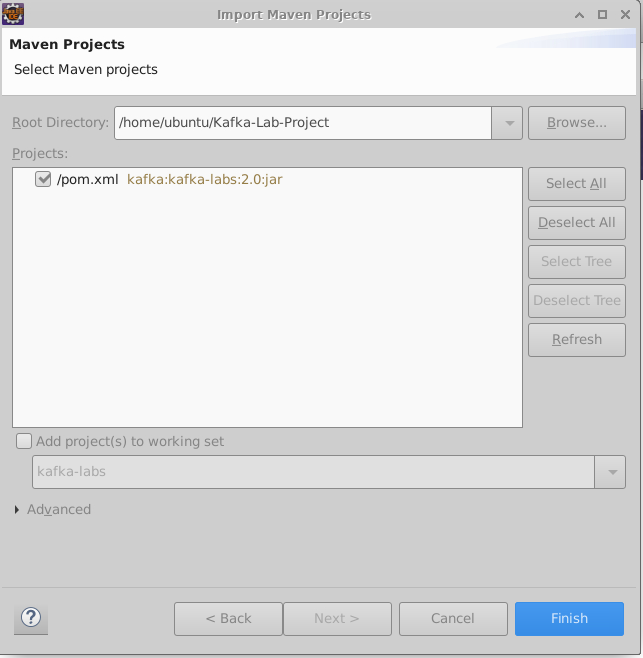
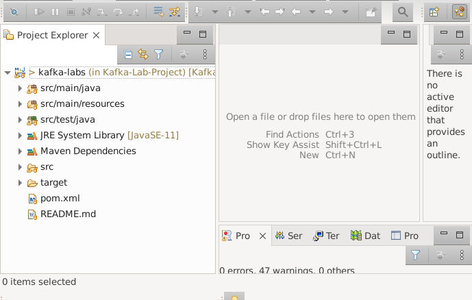

link rel='stylesheet' href='../assets/css/main.css'/>

[<< back to main index](../README.md)

# Lab 3.1 : Set up the Java API Project

---

### Change Log

Updated 2023-10-28

Rod Davison

---

### Overview
Set up the Java API code to run in Eclipse

### Depends On
None

### Run time
10 Minutes

## Step 1: Install Maven

The Maven build tool is needed to make the project.  Install Maven using the following command:

```bash
sudo apt update

sudo apt install maven -y
```

Once the installation finishes, check that it installed by typing:

```bash
mvn -version
```
If you get an error saying there is no such command, close the terminal window and open a new one and try again. You should see output that looks like this:

```console
Apache Maven 3.6.3
Maven home: /usr/share/maven
Java version: 11.0.20.1, vendor: Ubuntu, runtime: /usr/lib/jvm/java-11-openjdk-amd64
Default locale: en, platform encoding: UTF-8
OS name: "linux", version: "5.15.0-1022-aws", arch: "amd64", family: "unix"
```

## Step 2: Install Eclipse

In the firefox browser, go to the Eclipse download page at:

`https://www.eclipse.org/downloads/`

And select the download for the x86-64 architecture



Once the archive file has been downloaded, unpack it like by either using the `extract` option in the window manager or execute the following in the `Downloads` directory.:

```bash
tar xvf eclipse-inst-jre-linux64.tar.gz
```
Once it is extracted, run the installer program `eclipse-inst`.

This will start the installer. Accept all the defaults and let it run. This will take several minutes so be patient.

## Step 3: Download the lab project.

Clone the Kafka Lab project.

```bash
git clone https://github.com/ExgnosisClasses/Kafka-Lab-Project.git
```

## Step 4: Start Eclipse 

Start Eclipse and accept the default workspace choice as shown:




## Step 5: Import the Project

In Eclipse, from the `file` menu, select the `import` option. In the dialog box, select `Existing Maven Project`


Select `Next` and browse to the `Lab-Project` folder and select `open`  You know you have selected the right folder when you see:



Select `Finish` and the project should take only a few moments to load. There will be a number of warnings that you can ignore since they do not affect our labs.




---

## End Lab
