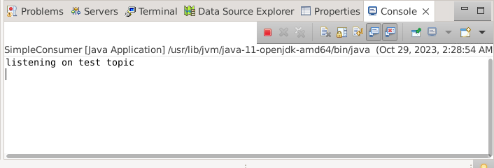
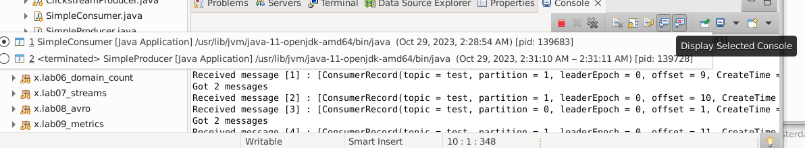

<link rel='stylesheet' href='../assets/css/main.css'/>

[<< back to main index](../README.md)

# Lab 3.2 : Simple Producer / Consumer

---

### Change Log

Updated 2023-10-28

Rod Davison

---

## Watch and Do

The instructor will walk through the complete lab and explain what is happening at each step. This is your opportunity to clarify any issue you might have about the code or concepts before you try it yourself.

## Overview

Run a simple producer and consumer using the Java API for Kafka

## Depends On

None

## Run time

30 Minutes

## Step 1 : Create `test` topic

You can clean out the existing topics by shutting down the servers, deleting their log files and then restarting them.

To shut down the servers execute the following two commands.

```bash
~/apps/kafka/bin/kafka-server-stop.sh

~/apps/kafka/bin/zookeeper-server-stop.sh

```
In the `/tmp` directory, delete the folders `zookeeper` and `kafka-logs` and **only** those two folders.

The restart the servers. They will automatically recreate the folders you just deleted.

```bash
 ~/apps/kafka/bin/zookeeper-server-start.sh ~/apps/kafka/config/zookeeper.properties

JMX_PORT=9999  ~/apps/kafka/bin/kafka-server-start.sh -daemon ~/apps/kafka/config/server.properties

```
Create the `test` topic

```bash
~/apps/kafka/bin/kafka-topics.sh  --bootstrap-server localhost:9092 --create --topic test --replication-factor 1  --partitions 2
```

## Step 2 : Run a console consumer

In a terminal do either of the following. The first option is the standard Kafka consuimer

```bash
~/apps/kafka/bin/kafka-console-consumer.sh \
        --bootstrap-server localhost:9092 \
        --property print.key=true --property key.separator=":" \
        --topic test
```

Or this one which is the kafkacat version

```bash
kafkacat -q -C -b localhost:9092 -t test -f 'Partition %t[%p], offset: %o, key: %k, value: %s\n'
```

## Step 3 : Simple Producer

In Eclipse, open the file  `src/main/java/x/lab03_api_intro/SimpleProducer.java`.

To run the Producer in Eclipse,
- Right click on 'src/main/java/x/lab03_api_intro/SimpleProducer.java'
- Run as 'Java Application'

In Eclipse console, you should see output something like this:
```console
Sent record [1] (key:1698546214628, value:Hello world @ 1698546214628), meta (partition=1, offset=0, timestamp=1698546214884), time took = 405.75 ms
Sent record [2] (key:1698546214629, value:Hello world @ 1698546214629), meta (partition=1, offset=1, timestamp=1698546215041), time took = 3.16 ms
Sent record [3] (key:1698546214630, value:Hello world @ 1698546214630), meta (partition=1, offset=2, timestamp=1698546215044), time took = 1.99 ms
Sent record [4] (key:1698546214631, value:Hello world @ 1698546214631), meta (partition=0, offset=0, timestamp=1698546215046), time took = 2.39 ms
```

## Step 4 : Monitor Kafka console consumer

Confirm that the messages are showing up in the console consumer

```console
Partition test[1], offset: 0, key: 1698546214628, value: Hello world @ 1698546214628
Partition test[1], offset: 1, key: 1698546214629, value: Hello world @ 1698546214629
Partition test[1], offset: 2, key: 1698546214630, value: Hello world @ 1698546214630
Partition test[0], offset: 0, key: 1698546214631, value: Hello world @ 1698546214631
Partition test[1], offset: 3, key: 1698546214632, value: Hello world @ 1698546214632
Partition test[1], offset: 4, key: 1698546214633, value: Hello world @ 1698546214633

```

## Step 5 : Running the Java Consumer

Open the file `src/main/java/x/lab03_api_intro/SimpleConsumer.java`

To run the Consumer in Eclipse,
    
- Right click on 'src/main/java/x/lab03_api_intro/SimpleProducer.java'
- Run as 'Java Application'

This will keep running until you stop it by pressing the red square near the console



## Step 6 : Run the Producer again

Right click on `src/main/java/x/lab03_api_intro/SimpleProducer.java`

Run as 'Java Application'

When running multiple Java at the same time, you can switch between their consoles by using the black inverted triangle next to the console icon.




Check on the output of the Java Consumer and the console consumer.

## Step 7: Run Two Consumers

Stop the Consumer running in Eclipse by selecting its console and pressing the red square. 

Leave console consumer running.

Run two instances of the `Simple Consumer` in Eclipse

Also run `SimpleProducer` from Eclipse.

How many messages each consumer get?  Can you explain?  Remember that both Consumers are in the same consumer group. 

Why is the console consumer still reading all the messages?

## Step 8:  Run Three Consumers

Stop the two running Consumers in Eclipse but leave the console consumer running.

Run three instances of the `Simple Consumer` in Eclipse.

Also run `SimpleProducer` from Eclipse.

How many messages each consumer get?  Can you explain the distribution of messages?
            
## Step 9:  Clean Up

Stop all the running Consumers in Eclipse

Stop the console consumer

---

## End Lab


